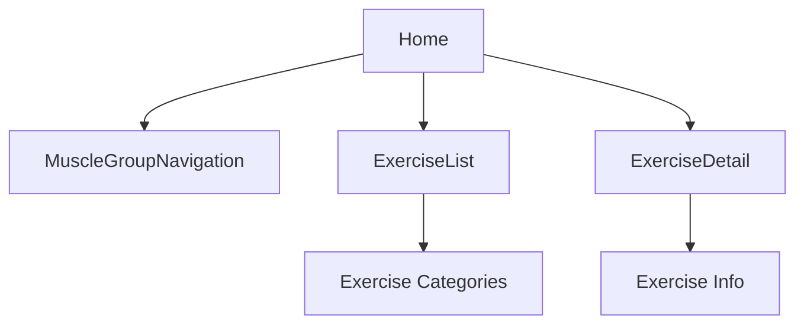
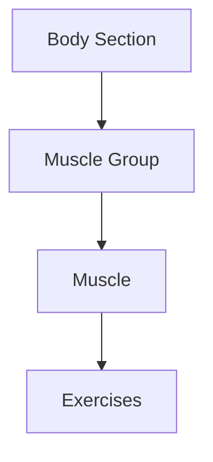
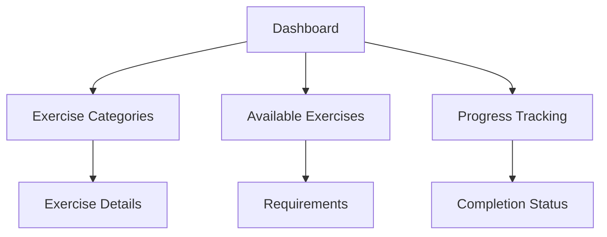
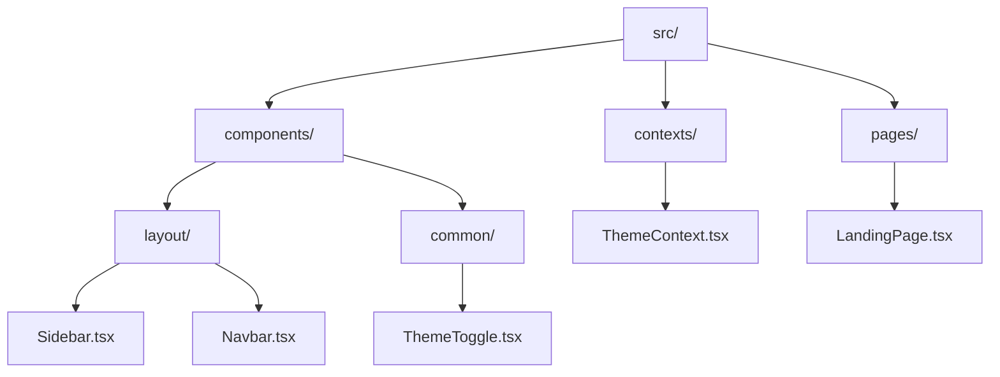
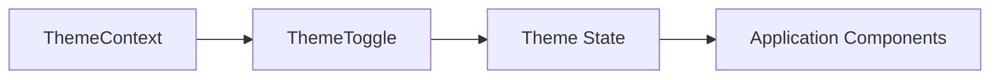
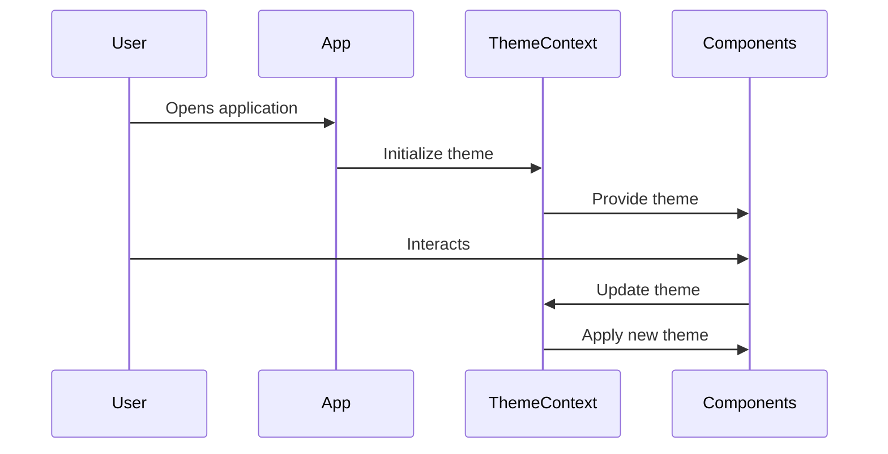
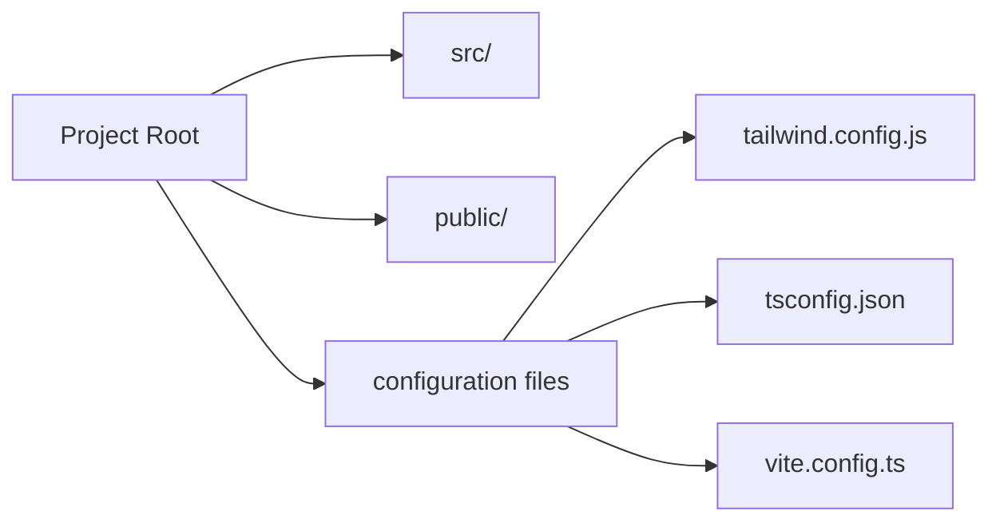
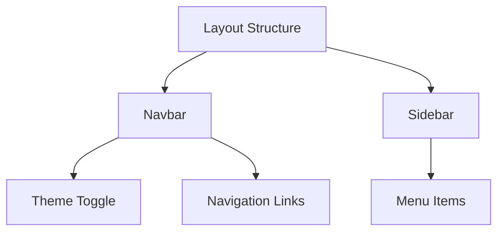

# FitQuest - Exercise Tracking & Achievement System

FitQuest is an interactive web application that helps users track their exercises and unlock achievements while making the fitness journey fun and engaging.

## Exercise System Architecture

### 1. Route Structure

The application uses a hierarchical routing system for exercise-related features:



### 2. Component Flow

#### MuscleGroupNavigation (`/`)
- Entry point for exercise navigation
- Uses `getBodySections()` to display main body sections ("Upper", "Lower")
- For each section, uses `getMuscleGroups()` to show muscle groups (e.g., "Chest", "Back", etc.)

Example usage:
```typescript
const bodySections = getBodySections(); // ["Upper", "Lower"]
const upperBodyGroups = getMuscleGroups("Upper"); // ["Chest", "Back", "Shoulders", "Arms"]
```

#### ExerciseList (`/exercises`)
- Displays exercises based on selected muscle group
- Uses `getMuscles()` to get specific muscles in a group
- Uses `getExercises()` to list exercises for each muscle

### 3. Data Structure

The exercise configuration follows this hierarchy:



Example:
```
Upper Body
└── Chest
    └── Upper Chest
        ├── Incline Bench Press
        ├── Incline Dumbbell Press
        └── Incline Cable Fly
```

### 4. Helper Functions

Available Utility Functions:
- `getBodySections()`: Returns ["Upper", "Lower"]
- `getMuscleGroups(section)`: Returns muscle groups for a body section
- `getMuscles(section, group)`: Returns muscles in a group
- `getExercises(section, group, muscle)`: Returns exercises for a specific muscle

## Features & Functionality

### 1. Exercise Dashboard


- View all available exercises by muscle group
- Track progress for each exercise
- Detailed form requirements
- Real-time progress tracking

### 2. Exercise Categories

#### Upper Body
- Chest
- Back
- Shoulders
- Arms

#### Lower Body
- Legs
- Core

### 3. Progress Tracking
- Real-time progress updates
- Visual progress bars
- Exercise completion estimates
- Historical exercise data

### 4. User Features
- OAuth integration
- Personal exercise statistics
- Progress history
- Achievement sharing capabilities

### 5. Interactive Guides
- Step-by-step exercise tutorials
- Best practices and tips
- Common pitfalls to avoid
- Community success stories

### 6. Community Features
- Share achievements on social media
- Compare progress with friends
- Exercise leaderboards
- Community tips and tricks

### 7. Notification System
- Exercise completion alerts
- Progress milestone notifications
- New exercise announcements
- Custom goal reminders

## Project Structure

The project follows a standard React application structure with TypeScript support:



## Getting Started

### Prerequisites
- Node.js (v16 or higher)
- npm or yarn

### Installation

1. Clone the repository
```bash
git clone <repository-url>
cd <project-directory>
```

2. Install dependencies
```bash
npm install
# or
yarn install
```

3. Start the development server
```bash
npm run dev
# or
yarn dev
```

The application will be available at `http://localhost:5173`

## Development Guidelines

### Component Structure
- Place new components in appropriate directories under `src/components/`
- Common/shared components go in `src/components/common/`
- Layout components go in `src/components/layout/`

### Styling
- Use Tailwind CSS classes for styling
- Custom styles can be added in `src/index.css`
- Follow the project's theme system using ThemeContext

### TypeScript
- Ensure proper typing for all components and functions
- Use interfaces for prop definitions
- Keep types and interfaces in separate files when they become complex

### State Management
- Use React Context for global state (like theme)
- Prefer local state for component-specific data
- Consider using React Query for API data management

## Technology Stack

- React with TypeScript
- TailwindCSS for styling
- Context API for state management
- React Router for navigation
- React Query for data fetching

## Future Enhancements

Planned features for the exercise system:
- Exercise search functionality
- Filtering by equipment type
- Custom exercise creation
- Exercise progress tracking
- Video demonstrations
- Form checking AI integration

This application helps users track their fitness journey while providing valuable insights into their exercise activities and achievements.

## Project Structure

The project follows a standard React application structure with TypeScript support:


## Core Components

### Layout Components
- `Navbar`: Main navigation component
- `Sidebar`: Side navigation/menu component

### Theme Management
The application implements a theme management system using React Context:



### Pages
- `LandingPage`: Main entry point for the application content

## Technology Stack

- React with TypeScript
- TailwindCSS for styling
- Context API for state management

## Application Flow



## Getting Started

### Prerequisites
- Node.js (v16 or higher)
- npm or yarn

### Installation

1. Clone the repository
```bash
git clone <repository-url>
cd <project-directory>
```

2. Install dependencies
```bash
npm install
# or
yarn install
```

3. Start the development server
```bash
npm run dev
# or
yarn dev
```

The application will be available at `http://localhost:5173`

## Development

### Project Structure


### Key Development Commands

```bash
# Start development server
npm run dev

# Build for production
npm run build

# Preview production build
npm run preview

# Run tests
npm run test
```

### Development Guidelines

#### Component Structure
- Place new components in appropriate directories under `src/components/`
- Common/shared components go in `src/components/common/`
- Layout components go in `src/components/layout/`

#### Styling
- Use Tailwind CSS classes for styling
- Custom styles can be added in `src/index.css`
- Follow the project's theme system using ThemeContext

#### TypeScript
- Ensure proper typing for all components and functions
- Use interfaces for prop definitions
- Keep types and interfaces in separate files when they become complex

#### State Management
- Use React Context for global state (like theme)
- Prefer local state for component-specific data
- Consider using React Query for API data management

# React + TypeScript + Vite

This template provides a minimal setup to get React working in Vite with HMR and some ESLint rules.

Currently, two official plugins are available:

- [@vitejs/plugin-react](https://github.com/vitejs/vite-plugin-react/blob/main/packages/plugin-react/README.md) uses [Babel](https://babeljs.io/) for Fast Refresh
- [@vitejs/plugin-react-swc](https://github.com/vitejs/vite-plugin-react-swc) uses [SWC](https://swc.rs/) for Fast Refresh

## Expanding the ESLint configuration

If you are developing a production application, we recommend updating the configuration to enable type aware lint rules:

- Configure the top-level `parserOptions` property like this:

```js
export default tseslint.config({
  languageOptions: {
    // other options...
    parserOptions: {
      project: ['./tsconfig.node.json', './tsconfig.app.json'],
      tsconfigRootDir: import.meta.dirname,
    },
  },
})
```

- Replace `tseslint.configs.recommended` to `tseslint.configs.recommendedTypeChecked` or `tseslint.configs.strictTypeChecked`
- Optionally add `...tseslint.configs.stylisticTypeChecked`
- Install [eslint-plugin-react](https://github.com/jsx-eslint/eslint-plugin-react) and update the config:

```js
// eslint.config.js
import react from 'eslint-plugin-react'

export default tseslint.config({
  // Set the react version
  settings: { react: { version: '18.3' } },
  plugins: {
    // Add the react plugin
    react,
  },
  rules: {
    // other rules...
    // Enable its recommended rules
    ...react.configs.recommended.rules,
    ...react.configs['jsx-runtime'].rules,
  },
})
```

## Features & Functionality

### Core Features

#### 1. Theme System
- Dark/Light mode toggle
- Persistent theme preference storage
- System theme detection and synchronization
- Smooth theme transitions

#### 2. Layout System


- Responsive navigation bar
- Collapsible sidebar
- Mobile-friendly layout
- Consistent theming across components

#### 3. Routing & Navigation
- Client-side routing
- Landing page
- Protected routes (if implemented)
- Navigation state management

#### 4. UI/UX Features
- Responsive design for all screen sizes
- Tailwind CSS styling
- Smooth transitions and animations
- Modern and clean interface

#### 5. Development Features
- Hot Module Replacement (HMR)
- TypeScript type checking
- ESLint configuration
- Development server with fast refresh

### Technical Features

#### State Management
- Context API implementation
- Theme state management
- Component-level state handling

#### Performance
- Vite-powered build system
- Optimized production builds
- Fast development server
- Code splitting

#### Development Tools
- TypeScript support
- ESLint integration
- Modern JavaScript features
- Developer-friendly error handling

### Planned Features
(Add any features that are planned for future implementation)
